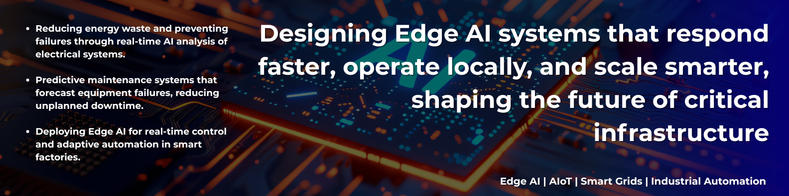
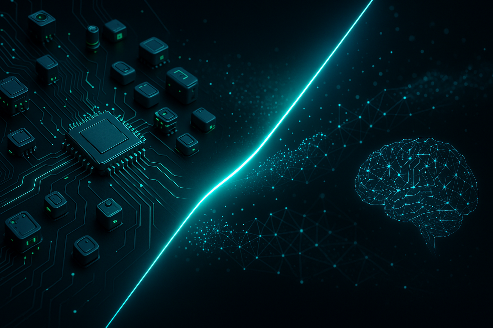

<!-- BANNER -->

  

<h1 align="center">👋 Hi, I'm Raciel D. Lago</h1>
<h3 align="center">
  🚀 Electrical Engineer & AI/Edge AI Specialist | Building Intelligent Solutions for Energy ⚡, Industry 🏭, and Sustainability 🌱
</h3>

  <em>"Shaping the Future with Smart Solutions"</em>

---

### 👨‍💻 About Me

I’m an **Electrical Engineer & AI/Edge AI Specialist** focused on developing **intelligent systems for energy, automation, and smart industry**.  
My work blends **embedded AI, IoT, and real-time control** to design solutions that make **power systems, factories, and buildings smarter and more sustainable**.

- ⚡ Designing **AIoT & Edge AI solutions** for **smart grids and energy communities**  
- 🏭 Building **prototypes for industrial automation, predictive maintenance, and Industry 4.0**  
- 🏠 Exploring **intelligent control in smart homes and buildings**  
- 🔧 Passionate about turning **AI algorithms into working embedded prototypes**  
<!-- - 🌍 Open to collaborations & opportunities in the Netherlands (remote or relocation) -->

---

### 🧠 Tech Stack & Focus

  <!-- Languages -->
  
  
  

  <!-- AI & ML -->
  
  
  
  <!--  -->

  <!-- Embedded & IoT -->
  
  
  
  
  
  

  <!-- Energy & Industry -->
  
  
  

  <!-- Tools & DevOps -->
  <!-- 
  
  
   -->

<!-- **Core:** Python, C/C++, MATLAB  
**AI & ML:** TensorFlow, PyTorch, Scikit-learn, ONNX  
**Embedded & IoT:** ESP32, nRF52, Raspberry Pi, Arduino, Edge AI, AIoT  
**Energy & Industry:** Smart Grids, Industrial Automation, Domotics  
**Tools:** Git, Docker, Linux, VS Code  -->

---

### 🚀 Featured Projects  

Here are some highlights of my work in **Edge AI, AIoT, and Smart Energy/Industry**.  
(*More projects coming soon as I keep building and publishing prototypes.*)  

🔋 **Smart Grid Community**  
*Interactive simulation of a smart energy system for testing AI algorithms, load management, and microgrids.*  
**Tech:** Python · Edge AI · IoT Sensors  

---

🏭 **Industrial Edge AI**  
*Prototypes for predictive maintenance and automation in Industry 4.0.*  
**Tech:** C++ · TensorFlow Lite · Embedded AI  

---

🏠 **Smart Home Controller**  
*AI-powered embedded system for domotics, energy monitoring, and automation.*  
**Tech:** ESP32 · MQTT · Edge AI  

<!-- Cards con imágenes (el más atractivo)

Puedes usar imágenes (mockups, diagramas, capturas) dentro de cada card. Ejemplo: -->
<!-- ### 🚀 Featured Projects  

  

**🔋 Smart Grid Community**  
*Interactive simulation of a smart energy system for testing AI algorithms, load management, and microgrids.*  
**Tech:** Python · Edge AI · IoT Sensors  

---

  

**🏭 Industrial Edge AI**  
*Prototypes for predictive maintenance and automation in Industry 4.0.*  
**Tech:** C++ · TensorFlow Lite · Embedded AI  -->
---

## ✍️ Blog & Writing  

I regularly write about **AIoT, Edge AI, Smart Grids, and AI in Industry**.  
Explore my full blog here 👉 [🔗 Visit My Blog](https://attheedge.super.site/)  

---

  
  

---

### 📌 Quick Reads
- [From Power Grids to Microcontrollers: My Edge AI Journey](https://yourbloglink.super.site/edge-ai-journey)  
- [AIoT in Smart Agriculture: Lessons from Prototyping](https://yourbloglink.super.site/smart-agriculture)  
- [Brain-Computer Interfaces: Early Experiments with OpenBCI](https://yourbloglink.super.site/bci-experiments)  

---

### 🌐 Connect With Me

  
  
  

