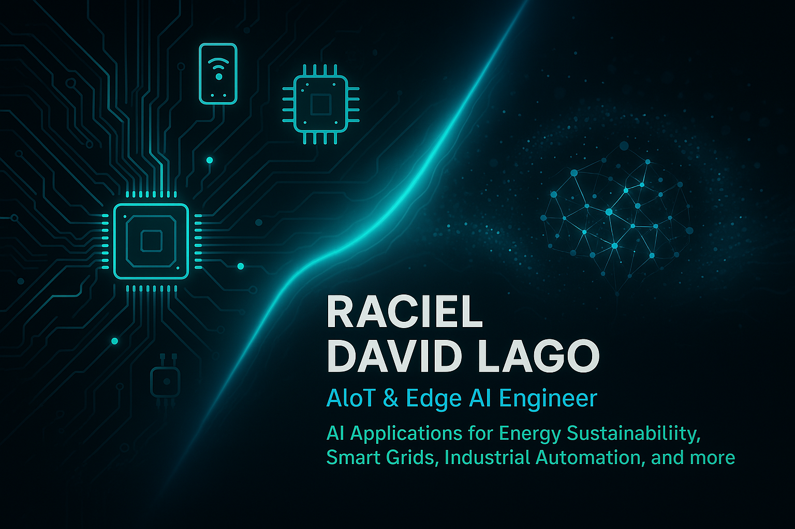

<!-- Encabezado visual -->
<p align="center">
  
</p>

---

<h2 align="center">👋 Welcome to my digital lab</h2>
<h3 align="center">Shaping the Future with Smart Solutions</h3>

<p align="center">
  🚀 Electrical Engineer | AI & IoT Specialist | Embedded & Edge AI Innovator<br/>
  🌍 Based in Cuba — aiming for Amsterdam 🇳🇱<br/>
  💡 Creating sustainable, intelligent systems for energy, health, and agriculture
</p>

---

### 👨‍💻 About Me

I’m **Raciel David Lago**, a passionate electrical engineer, software developer, and professor.  
With a strong focus on **AI, AIoT, and Edge AI**, I create real-world solutions for **smart energy**, **precision agriculture**, **healthcare technology**, and **Industry 4.0**.

- 🧠 Founder of a scientific group researching **AI in Smart Grids**
- 📡 Builder of prototypes: AIoT, BCI, sensors, firmware, control systems
- 📘 Educator at University of Oriente, Cuba (Electrical Circuits & Embedded AI)
- 🎮 Creator of indie games, interactive dashboards, and digital art
- 🌱 Advocate of sustainability, open knowledge, and innovation

---

### 🛠 Tech Stack

```yaml
Languages:    Python, C/C++, JavaScript, MATLAB
Frameworks:   TensorFlow, PyTorch, OpenCV, React, Node.js, Express
Embedded:     nRF52, Arduino, ESP32, Raspberry Pi
AI/IoT:       TinyML, Edge Impulse, MQTT, BLE, OpenBCI, OpenViBE
Tools:        Git, GitHub Actions, Docker, VS Code, Figma, Notion
Cloud/Infra:  Firebase, Supabase, REST APIs, Grafana, CI/CD

🚀 Featured Projects
Project	Description	Tech
🌾 Smart Agro System	Edge AI for precision irrigation and crop monitoring	nRF52, Edge Impulse
⚡ AI in Smart Grids	Forecasting, load balancing, energy analytics	Python, TensorFlow, Dash
🧠 BCI Medical AI	Brain-Computer Interface for assistive tech	OpenBCI, OpenViBE, Python
🏠 Domotics Lab	Interactive dashboard for smart home	React, Node, Firebase
🔬 AIxIoT Research	Scientific group innovations & prototypes	Embedded AI + Cloud

📂 You can explore these in detail on my Portfolio and GitHub Projects

📌 Now Working On
🧪 Weekly AIxIoT/Edge AI Projects (75-week challenge)

🧠 Medical AI & BCI Research at Medical Biophysics Center

⚙️ Academic smart grid model with real-time simulation

🖋 Writing technical blogs & guides on AI, IoT, and automation

🌍 Preparing for global opportunities in Europe

🧭 Let's Connect
<p align="center"> <a href="https://www.linkedin.com/in/racieldavidlago/"></a> <a href="https://racieldavid.github.io"></a> <a href="mailto:raciel.lago@gmail.com"></a> <a href="https://github.com/RacielDavid"></a> </p>
🧠 GitHub Stats
<p align="center">    </p>
<p align="center"> <em>“The best way to predict the future is to engineer it.”</em> </p> ```
